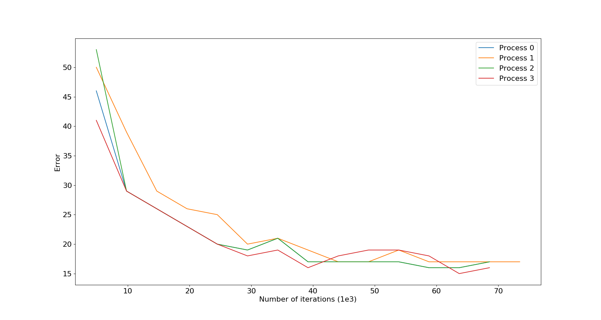
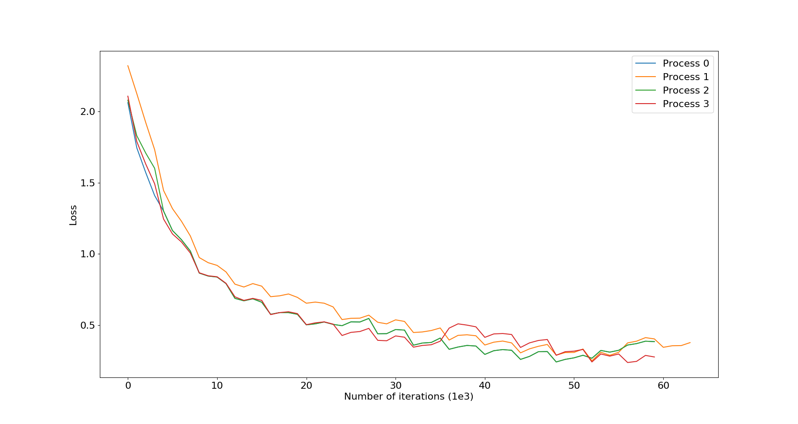

#Population Based Training of ResNet for CIFAR10 using PyTorch

##Overview
This code implements [Population Based Training](https://arxiv.org/pdf/1711.09846.pdf) of ResNet for CIFAR10 dataset.
It achieves a Top1 Error of 15%. Here 4 networks are run in parallel with different initial hyperparameters. After every 4900 iterations the validation error is calculated for each network. If a network's accuracy is not in the top 20% then the netowrk randomly selects another network from the top 20% of the best performing networks. It copies its weights as well as hyperparameters. The copied hyperparameters are then perturbed by randomly selecting a perturbation from the range 0.5 to 2. This process continues on for 63700 iterations. 

##Loading the dataset
The dataset can be loaded by running the load_data.sh script

##Training
To train the network run cifar_10.py. This code doesn't use GPUs. For the GPU version of the code check the other branch. 

The graphs for loss and Validation iterations are shown below

